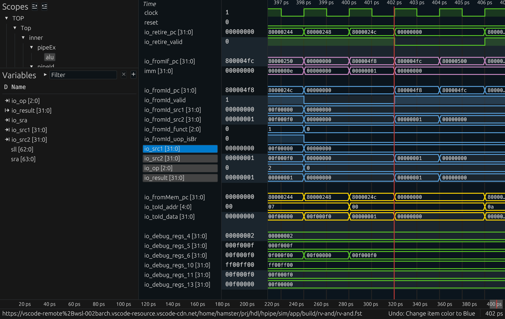

# HPipe

Hamster's Pipelined RISC-V CPU Core

This design is for learning purpose


## Quick Start

Export to SystemVerilog
```bash
make verilog
```

Run specific App with HPipe simulator
```bash
make sim APP=rv-tests    # Folder names in `sim/app`, except `common`, are valid app names
make wave APP=rv-tests   # With waveform generated under `sim/app/build/<name>/<name>.fst`
```

Run with a GDB session
```bash
make gdb-server

# In another shell
make gdb
```

Run Backend Analysis
```bash
make init-backend # This only need to run once
make backend
```

## Architecture

This Core implements a classical 5-stage pipelined CPU.  

Currently it only supports RV32I, but more extensions are on the way.


### IF & BTB

The IF stage involves a 16-entry BTB with 2-bit saturation counters for each entry, adopting **LR** substitution strategy.

The Penalty of branch miss is **2 cycles**.


### ID

The ID stage decodes each instruction into uops that determines the behavour of EX and MEM stages.


### EX

The EX stage currently uses symbol `+` as the Adder Implemention. Should be optimized soon.


### MEM

The MEM stage uses a simple interface to interact with MMIOs. AXI support is planned.


### WB

The WB stage signals whether a valid instruction is retired.


### Feed Forward

There're 2 primary paths to forward:

1. ID

The ID stage requires up-to-date source data (`rs1` & `rs2`). Thus, if `rs1` or `rs2` will be written by the instructions executing in EX or MEM stage, the dest data should be forwarded to ID.

- EX -> ID: No stalls/bubbles required
- MEM -> ID: No stalls/bubbles required
- EX(needs MEM) -> ID: 1 cycle's stall


2. IF

The IF stage requires `rs1` to generate the address of `JALR` to predict jump location.  

If `rs1` can be forwarded, BTB will predict correctly, as `JALR` always takes branch; otherwise, BTB won't predict, as dest pc is not known for now.

- ID -> IF: Will not predict
- EX -> IF: Predict
- MEM -> IF: Predict
- EX(needs MEM) -> IF: Will not predict


## PPA

All characteristics were estimated using [icsprout55](https://github.com/openecos-projects/icsprout55-pdk) 55nm PDK

- Power = 2.419W
- Clock Freq = 580.101Hz
- Area = 29903.16nm2


## Road Map
- [x] Enable GDB Debugging
- [x] Testbenches & Unit Tests using `verilator` and [`riscv-tests`](https://github.com/riscv-software-src/riscv-tests)  
- [ ] RV32M extension  
- [x] Yosys-based backend analysis
- [x] Branch Prediction & Optimized Branch Penalty
- [ ] CSRs supporting M mode
- [ ] L1 Cache & TLB
- [ ] AXI Bus

## ScreenShots
1. HPipe under simulation, passing every isa test in `riscv-tests`


1. Waveform of a running HPipe



## Acknowledgements

This project exists with the help of the Open Source Community.  

Thanks
- [The YSYX Project](https://ysyx.oscc.cc/) for providing a comprehensive walkthough of the Processor full-stack design & validation, along with a set of open source projects. The transplant of `riscv-tests` and `backend` won't exist without it.
- [mini-gdbstub](https://github.com/RinHizakura/mini-gdbstub) for providing a really simple gdb server framework
